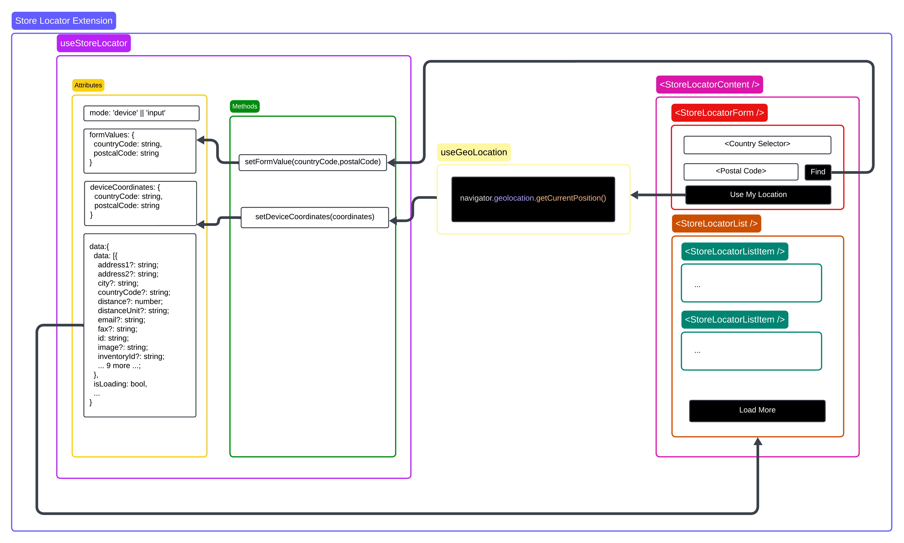

# Store Locator Extension

A [PWA Kit](https://github.com/SalesforceCommerceCloud/pwa-kit) extension that adds store locator functionality to your application. This extension provides a store locator solution with features like:

- Search stores by postal code / country code via SCAPI Shopper Stores API
- Device geolocation support
- Configurable search radius
- Multi-country support

## Installation

```sh
npm install @salesforce/extension-chakra-store-locator

# Also:
# - install the peer dependencies listed in the package.json
# - see the Peer Dependancies section below for any other steps (e.g. make sure your app uses CommerceApiProvider component)
```

## Peer Dependancies

PWA-Kit Application Extensions are NPM packages at their most simplest form, and as such you can define
what peer dependencies are required when using it. Because this application extension provides
Chakra UI via a page and components, it requires that the some peer dependencies are installed.

Depending on what features your application extensions provides it's recommended you include any third-party
packages as peer dependencies so that your base application doesn't end up having multiple versions of a
given package. See package.json for the full list of peer dependencies.

### `@Chakra-ui` Provider

This extension uses the `@chakra-ui` package as the UI library. Your application should use the `ChakraProvider` in the React component tree.

If you want to use this without having to install `@chakra-ui` in your project, a `withOptionalChakraProvider` HOC is provided and is used in the extension.

### `@salesforce/commerce-sdk-react` Provider

This extension uses the `@salesforce/commerce-sdk-react` package to fetch the store locator data from SCAPI. If you provide a `commerceApi` configuration in the extension config, the `CommerceApiProvider` will be added to the React component tree as the default provider. If you already have a `CommerceApiProvider` in your application, do not include the `commerceApi` configuration in the extension config.

## Configurations

The Store Locator extension is configured via the `mobify.app.extensions` property in the config files or `package.json` file.

```json
{
  "mobify": {
    "app": {
      "extensions": [
        [
          "@salesforce/extension-chakra-store-locator",
          {
            "enabled": true,
            "path": "/store-locator",
            "radius": 100,
            "radiusUnit": "km",
            "defaultPageSize": 10,
            "defaultPostalCode": "10178",
            "defaultCountry": "Germany",
            "defaultCountryCode": "DE",
            "supportedCountries": [
              {
                "countryCode": "US",
                "countryName": "United States"
              },
              {
                "countryCode": "DE",
                "countryName": "Germany"
              }
            ],
            "commerceApi": {
              "proxyPath": "/mobify/proxy/api",
              "parameters": {
                "shortCode": "8o7m175y",
                "clientId": "c9c45bfd-0ed3-4aa2-9971-40f88962b836",
                "organizationId": "f_ecom_zzrf_001",
                "siteId": "RefArchGlobal"
              }
            }
          }
        ]
      ]
    }
  }
}
```

## System Diagram



### Store Locator List Item

The Store Locator List Item component is a child component of the Store Locator List component. It receives a `store` prop and displays the store information. The store object is the same as the one returned by the SCAPI Shopper Stores API.

To override this file, create a matching file structure in your project's `overrides` directory. For example:

```
your-project/
  src/
    overrides/
      components/
          list-item.tsx
```
